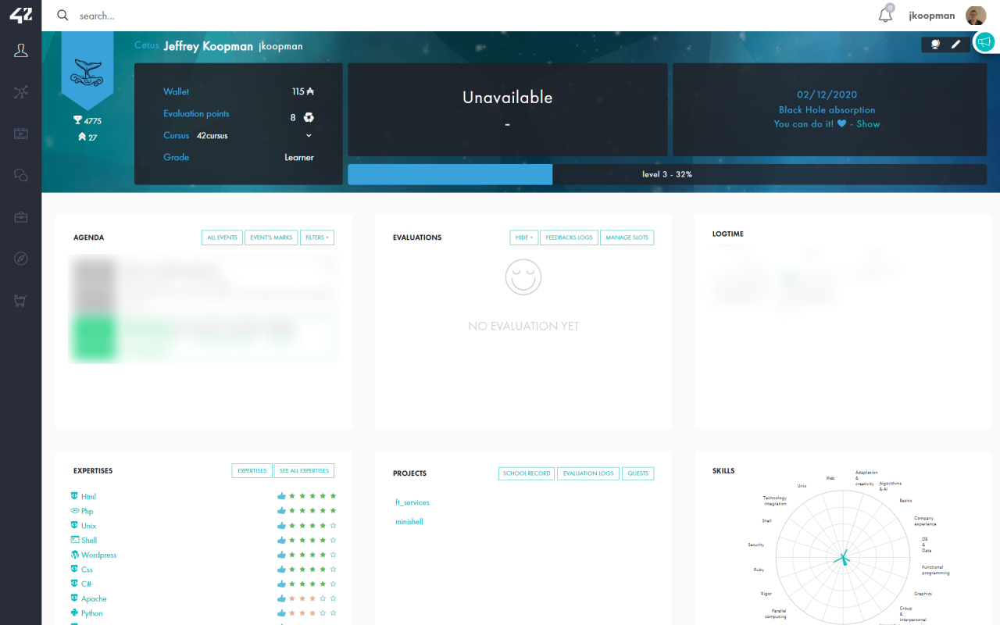
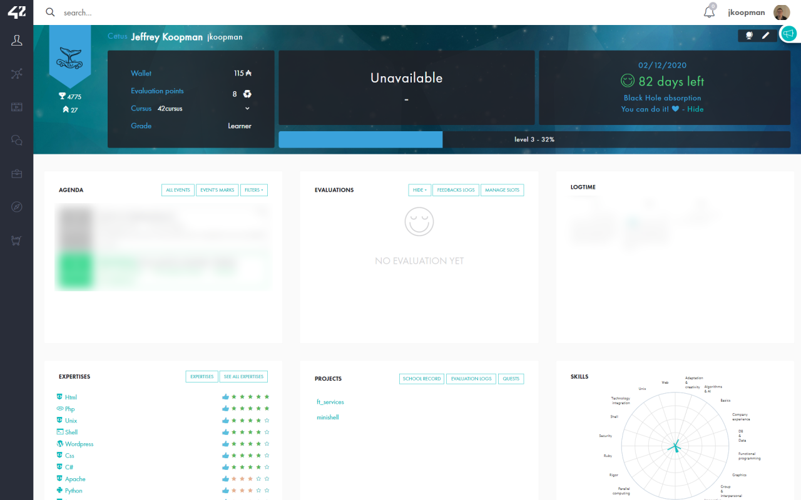

# Better Black Hole

Feeling pressured by the Black Hole and the counter that comes with it? With this extension, you are able to hide the demotivating countdown and sad emote, replacing it by just a date and a motivating message for extra motivation.

## Installation from stores
Chrome: [Better Black Hole for Chrome](https://chrome.google.com/webstore/detail/better-black-hole-42-intr/oimhggembfdoaimpkppcpdjnfejiakbf)
Firefox: [Better Black Hole for Firefox](https://addons.mozilla.org/en-US/firefox/addon/better-black-hole/)

## What does it look like?
As we all know, the current way of displaying your Black Hole date is with a colored emote. This can be perticularly demotivating when you see it moving from green... to orange... to red...

When you install this browser extension, all user profiles will be populated a better way of displaying the Black Hole date.

## Other functionality
The new way of displaying also comes with a clickable "Show" / "Hide" link, that will (temporarily) show the emote again.

## Planned features
 - Adding settings to enable / disable the show / hide link.
 - Adding setting for the motivational message.
 - Randomized motivational messages.